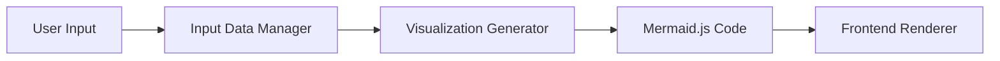

# 📑 Visualization Generator API v1.0

## 1. モジュール概要 (Module Overview)
Visualization Generator は StructNote の **可視化エンジン** であり、  
入力テキストを **Mermaid.js 形式のコード** に変換し、ブラウザで可視化する。  

- **目的**: 思考の可視化・構造化  
- **入力**: ユーザーのテキスト (メモ、ノート、要点)  
- **出力**: Mermaid.js コード（JSON 形式で返却）  
- **用途**: フロントエンドで思维导图 / 流程图として表示  

関係モジュール:  
- Input Data Manager → テキスト入力を管理  
- Visualization Generator → テキストを図に変換  
- Report Generator → Markdown / PDF / HTML レポートに出力  

---

## 2. API 設計

### 2.1 エンドポイント
- `POST /visualize`

### 2.2 入力 (Request)
```json
{
  "content": "任务A -> 任务B -> 任务C"
}
```
### 2.3 出力 (Response)

成功時のレスポンス例:

```json
{
  "status": "success",
  "data": {
    "mermaid": "graph TD; A[任务A] --> B[任务B] --> C[任务C];"
  }
}
```
### 2.4 エラー処理

失敗時のレスポンス例:

```json
{
  "status": "error",
  "message": "Input content is empty or invalid"
}
```

- `status`: "error"
- `message`: エラーの詳細メッセージ

HTTP ステータスコード一覧:
- `200 OK` : 正常終了
- `400 Bad Request` : 入力が空、または解析不能
- `500 Internal Server Error` : 内部処理エラー（Mermaid 生成失敗など）

---

## 3. データフロー (Data Flow)



1. ユーザー入力を受け取る
2. ルールベース/NLP で簡易解析・構造化
3. Mermaid.js 形式に変換
4. フロントエンドへ返却して描画

---

## 4. フロントエンド設計

- 利用ライブラリ: Mermaid.js
- 描画方法:
  - `<div class="mermaid">...</div>` にコードを挿入
  - Mermaid の初期化で自動レンダリング

### 4.1 Chrome Extension / Browser

- `popup.html` / `content.js` で Mermaid.js を読み込み
- `POST /visualize` を呼び出し、JSON の `mermaid` を取得
- DOM に挿入し、Mermaid を初期化して描画
- エラーメッセージは画面上部に通知表示（Toast など）

### 4.2 ユーザー操作

- 「再生成」ボタン: 同一入力で API 再実行
- 「导出」: PNG / SVG 出力（`mermaidAPI.render` の結果を利用）

---

## 5. 今後の拡張 (Future Extensions)

- 複数図表形式:
  - Flowchart (TD/LR)
  - Mindmap (Mermaid beta)
  - Sequence diagram
- スタイル拡張:
  - ノード色/形状/アイコン対応
- NotebookLM 連携:
  - 検索結果からの自動可視化生成
- Report Generator 連携:
  - 生成図を Markdown/PDF/HTML に埋め込み


