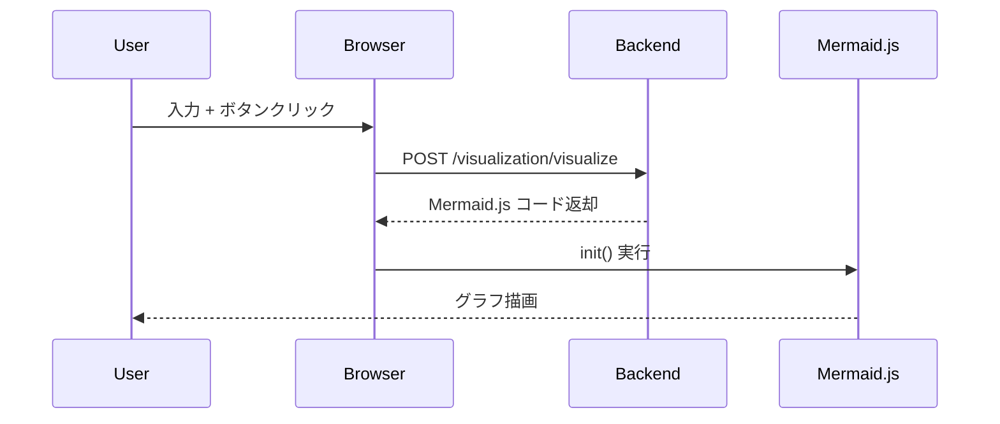

# Visualization Frontend v1.0

対応モジュール:  
- `frontend/index.html`  
- `frontend/mermaid_renderer.js`

目的: 入力テキストを API に送信し、返却された Mermaid.js コードをブラウザで描画する。

---

## 1. 概要
- ユーザーが入力したテキストを Backend API `/visualization/visualize` に送信する。  
- 返却された Mermaid.js コードをブラウザでレンダリングする。  
- 最小実装 (MVP) として、1ページ構成（HTML + JavaScript）で実現する。  

---

## 2. UI 設計

### 構成要素
- **入力エリア**: テキスト入力欄（例: `"A -> B -> C"`）  
- **操作ボタン**: 「生成」ボタン  
- **出力エリア**: Mermaid.js 描画用コンテナ  

### HTML 構成図
```plaintext
index.html
 ├─ <textarea id="input"></textarea>
 ├─ <button id="generate">生成</button>
 └─ <div class="mermaid" id="diagram"></div>
```
## 3. API コールフロー


## 4. 技術選定

- HTML5 + Vanilla JavaScript: シンプルで依存ライブラリなし

- Mermaid.js (CDN): 図表描画ライブラリ

- fetch API: Backend との通信

- Backend: FastAPI /visualization/visualize

## 5. 将来拡張

- エラーメッセージ表示（入力空 / API 失敗時）

- 図のエクスポート機能 (PNG/SVG)

- UI スタイル調整 (Bootstrap/Tailwind)

- Chrome Extension への移行

